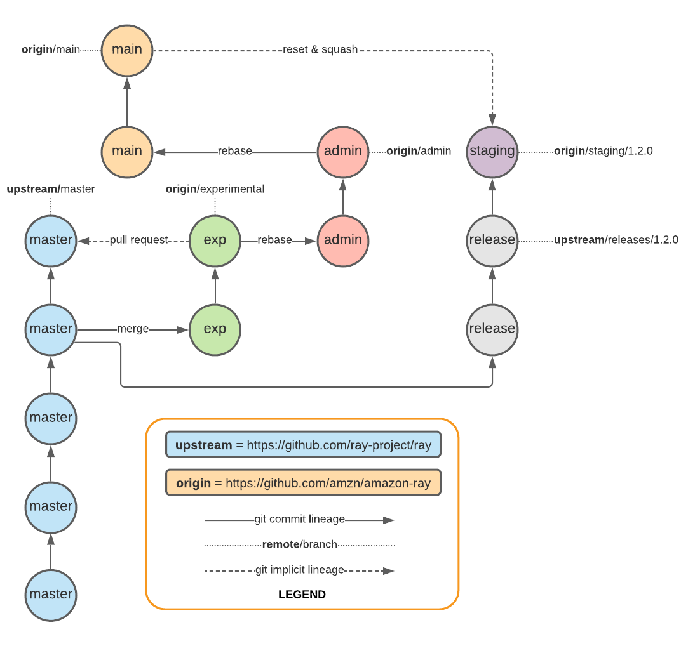

# Contributing Guidelines

Thank you for your interest in contributing to our project. Whether it's a bug report, new feature, correction, or additional
documentation, we greatly value feedback and contributions from our community.

Please read through this document before submitting any issues or pull requests to ensure we have all the necessary
information to effectively respond to your bug report or contribution.

## Reporting Bugs/Feature Requests

We welcome you to use the GitHub issue tracker to report bugs or suggest features.

When filing an issue, please check existing open, or recently closed, issues to make sure somebody else hasn't already
reported the issue. Please try to include as much information as you can. Details like these are incredibly useful:

* A reproducible test case or series of steps
* The version of our code being used
* Any modifications you've made relevant to the bug
* Anything unusual about your environment or deployment

## Contributing via Pull Requests
Contributions via pull requests are much appreciated.

Amazon-Ray comes with three major branches: experimental, admin and main.
The *experimental* branch holds all pending contributions back to the [Ray Project](https://github.com/ray-project/ray).
Your pull request should take place off of this branch.
The *admin* branch works on top of *experimental* and contains administrative changes specific to this repository (e.g. documentation, Travis CI configuration, etc.). The *main* branch periodically integrates changes from *admin*.

The branch relationship is depicted in the diagram below.

Before sending us a pull request, please ensure that:

1. You are working against the latest source on the *experimental* branch.
2. You check existing open, and recently merged, pull requests to make sure someone else hasn't addressed the problem already.
3. You open an issue to discuss any significant work - we would hate for your time to be wasted.

To send us a pull request, please:

1. Fork the repository.
2. Modify the source; please focus on the specific change you are contributing. If you also reformat all the code, it will be hard for us to focus on your change.
3. Ensure unit tests pass.
4. Make sure that your code passes the linter. Run `setup_hooks.sh` to create a git hook that will run the linter before you push your changes.
5. Add new unit tests for your code.
6. Commit to your fork using clear commit messages.
7. Send us a pull request, answering any default questions in the pull request interface.
8. Pay attention to any automated CI failures reported in the pull request, and stay involved in the conversation.

GitHub provides additional document on [forking a repository](https://help.github.com/articles/fork-a-repo/) and
[creating a pull request](https://help.github.com/articles/creating-a-pull-request/).

## Finding contributions to work on
Looking at the existing issues is a great way to find something to contribute on. As our projects, by default, use the default GitHub issue labels (enhancement/bug/duplicate/help wanted/invalid/question/wontfix), looking at any 'help wanted' issues is a great place to start.

## Code of Conduct
This project has adopted the [Amazon Open Source Code of Conduct](https://aws.github.io/code-of-conduct).
For more information see the [Code of Conduct FAQ](https://aws.github.io/code-of-conduct-faq) or contact
opensource-codeofconduct@amazon.com with any additional questions or comments.

## Security issue notifications
If you discover a potential security issue in this project we ask that you notify AWS/Amazon Security via our [vulnerability reporting page](http://aws.amazon.com/security/vulnerability-reporting/). Please do **not** create a public github issue.

## Licensing

See the [LICENSE](LICENSE) file for our project's licensing. We will ask you to confirm the licensing of your contribution.
